# Scenario 1 — Build a service from source

**~15 minutes · no YAML, no local container build**

In this scenario you deploy the **[Go greeter service](https://github.com/openchoreo/sample-workloads/tree/main/service-go-greeter)**
straight from its Git repository, entirely through the OpenChoreo console. OpenChoreo clones
the repo, builds the container image in-cluster from the project's `Dockerfile` (using the
**workflow plane**), publishes it to the in-cluster registry, and deploys it to the
**Development** environment — then you call the running endpoint.

This is the "golden path" for a developer who has source code and a `Dockerfile` and just wants a
running, reachable service.

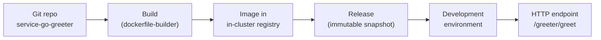

---

## Before you start

- You have completed the [installation guide](../../installation/README.md) and all four planes are
  running (in particular the **[workflow plane](../../installation/05-workflow-plane.md)** — it runs
  the build). Check with:
  ```bash
  kubectl get clusterworkflowplane
  ```
- You can open the developer console and sign in (see
  [Step 7 — Verify](../../installation/07-verify.md#71-log-in-to-the-openchoreo-console)):
  - **URL:** <http://openchoreo.localhost:8080>
  - **Username:** `admin@openchoreo.dev`
  - **Password:** `Admin@123`

### What we'll build

| Field | Value |
|-------|-------|
| Component name | `greeter-service` |
| Type | **Service** (`deployment/service`) |
| Deployment source | **Build from Source** |
| Build workflow | `dockerfile-builder` |
| Git repository | `https://github.com/openchoreo/sample-workloads` |
| Branch | `main` |
| Application path | `service-go-greeter` |
| Docker context | `/service-go-greeter` |
| Dockerfile path | `/service-go-greeter/Dockerfile` |
| Endpoint | `greeter-api` — HTTP, port `9090`, external |

---

## Step 1 — Create the component

From the left sidebar choose **Create…**, then **Component**, then the **Service** template
(*"A long-running request-serving component with one or more endpoints"*).

On the **Component Metadata** step, leave **Namespace** and **Project** as `default` and fill in:

- **Component Name:** `greeter-service`
- **Display Name:** `Greeter Service`
- **Description:** `A simple Go HTTP greeter service built from source`

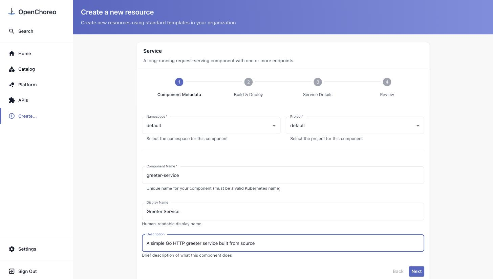

Click **Next**.

## Step 2 — Configure the build from source

On the **Build & Deploy** step, select **Build from Source** as the deployment source, then set:

- **Build Workflow:** `dockerfile-builder` — *builds with a provided Dockerfile/Containerfile*
- **Git Repository URL:** `https://github.com/openchoreo/sample-workloads`
- **Branch:** `main`
- **Application Path:** `service-go-greeter`

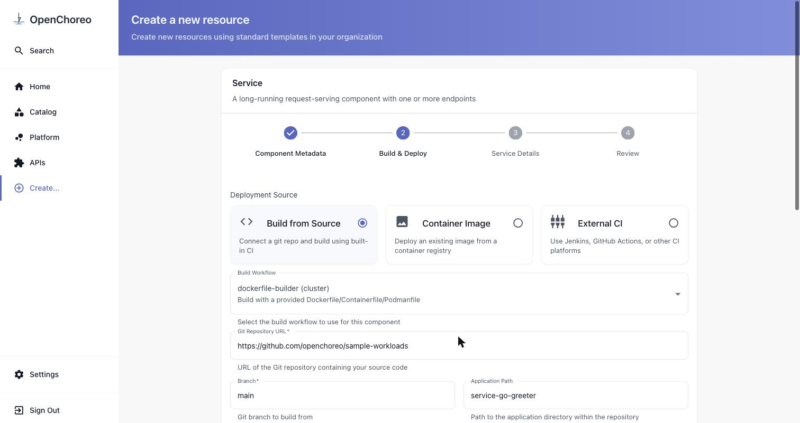

Scroll down to the **Docker** section and set the paths (they are relative to the **repository
root**, so they include the app folder):

- **Context:** `/service-go-greeter`
- **File Path:** `/service-go-greeter/Dockerfile`

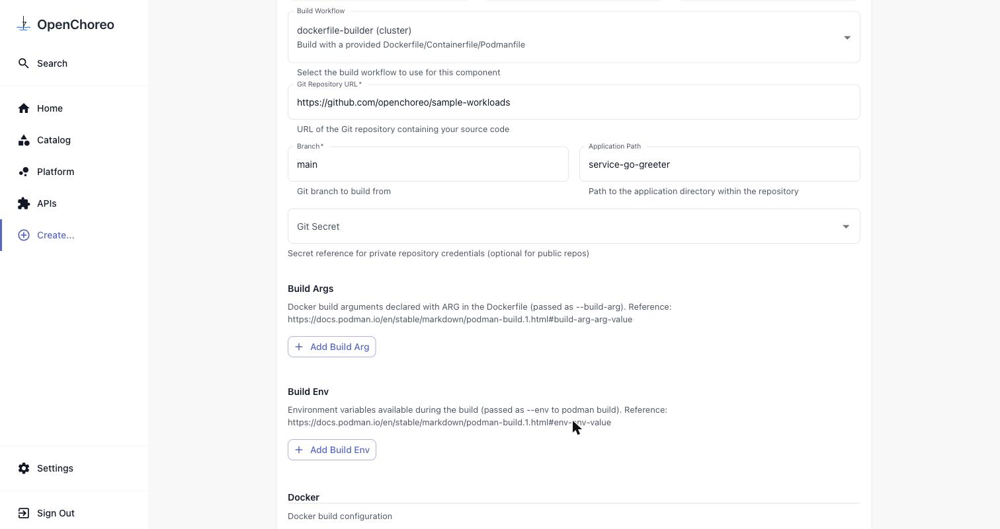

> Leave **Git Secret** empty — the sample repo is public. **Build Args** and **Build Env** are not
> needed for the greeter.

Click **Next**. The **Service Details** step can be left at its defaults — the greeter's endpoint is
declared in the repo's [`workload.yaml`](https://github.com/openchoreo/sample-workloads/blob/main/service-go-greeter/workload.yaml)
and is discovered automatically after the build. Click **Review**.

## Step 3 — Review and create

Check the summary. Note **Auto Deploy: No** — we'll trigger the build and deploy manually so you can
watch each stage.

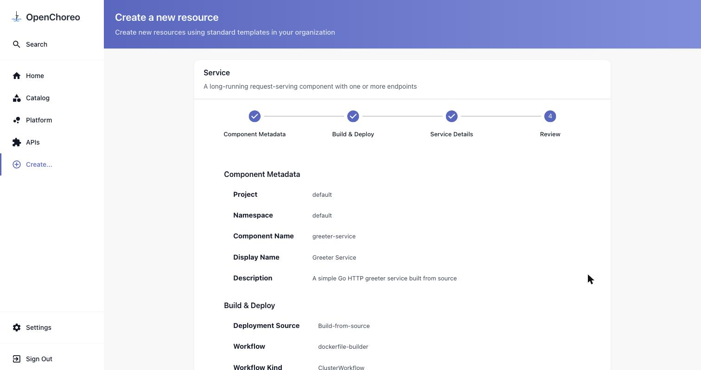

Click **Create**. OpenChoreo creates the component and drops you on its page.

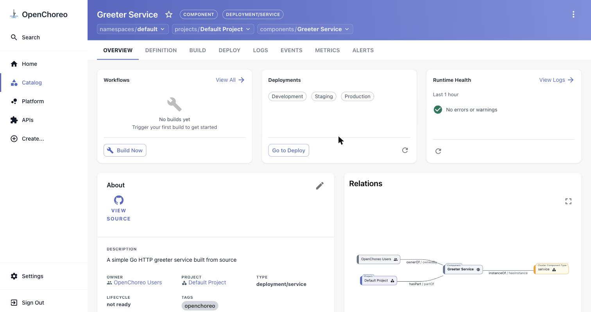

## Step 4 — Build from source

On the **Overview** tab, in the **Workflows** card, click **Build Now** (or open the **BUILD** tab
and click **Build Latest**). A workflow run appears with status **Running** — this is the workflow
plane cloning the repo and building the image.

Open the run to watch the steps stream their logs. `build-image` runs the multi-stage `Dockerfile`
(`go build …`, then a slim `alpine` runtime image):

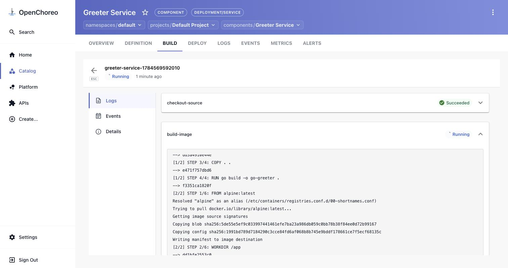

After a couple of minutes all four steps go green — `checkout-source`, `build-image`,
`publish-image`, and `generate-workload-cr` (which reads `workload.yaml` and registers the
endpoint):

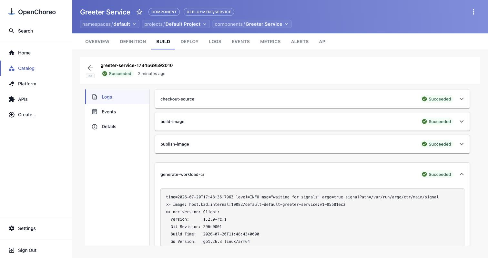

> **Tip — watch it from the terminal too:**
> ```bash
> kubectl get workflow -n workflows-default --watch
> ```
> When the build finishes you'll also see a new **API** tab appear on the component.

## Step 5 — Create a release and deploy to Development

Open the **DEPLOY** tab. You'll see the promotion pipeline — **Development → Staging → Production** —
all *Not Deployed*. In the **Set up** panel on the right, click **Create release**.

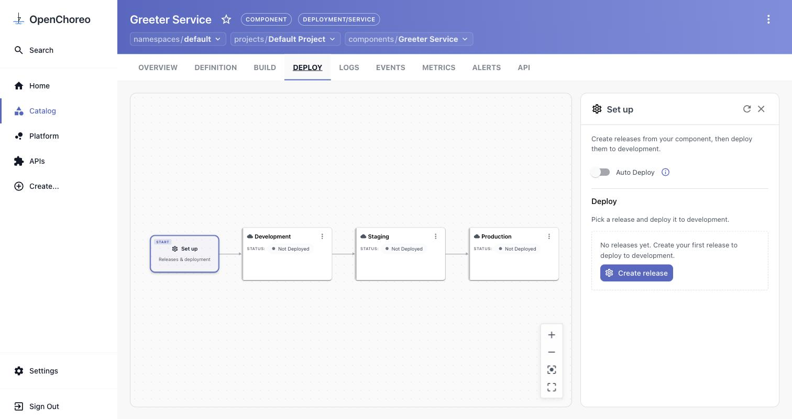

The release form is pre-filled from the build — the **Image** points at the freshly built image in
the in-cluster registry, and the **Endpoints** tab already shows `greeter-api` on port `9090`
(discovered from `workload.yaml`):

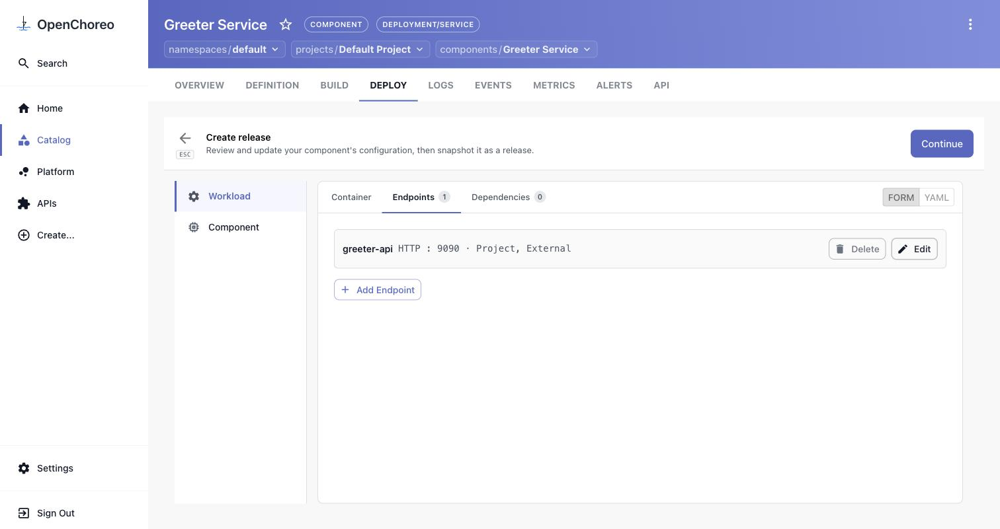

Click **Continue**, leave the release name blank (OpenChoreo generates one), and confirm
**Create release**. Back on the pipeline, pick the new release and click **Deploy**, then **Deploy**
again on the overrides screen (no overrides needed).

After a few seconds **Development** turns **Active**, showing the deployed release and its external
endpoint URL:

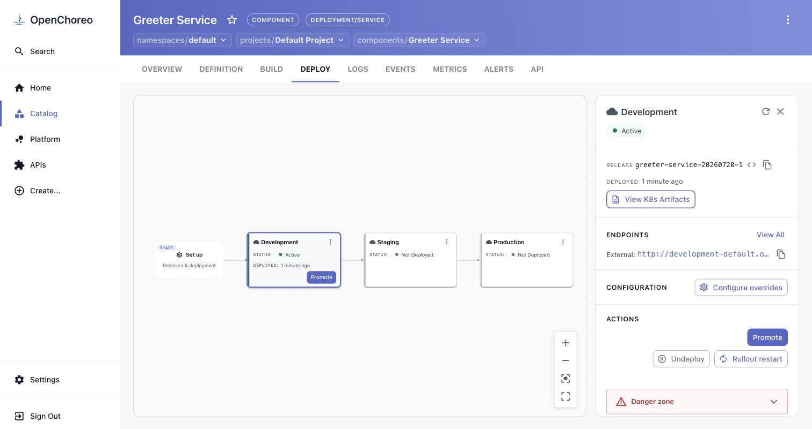

## Step 6 — Test the running service

The greeter exposes a single endpoint — `GET /greeter/greet?name=<name>` — as documented in the
API's **DEFINITION** tab (rendered from the repo's `openapi.yaml`):

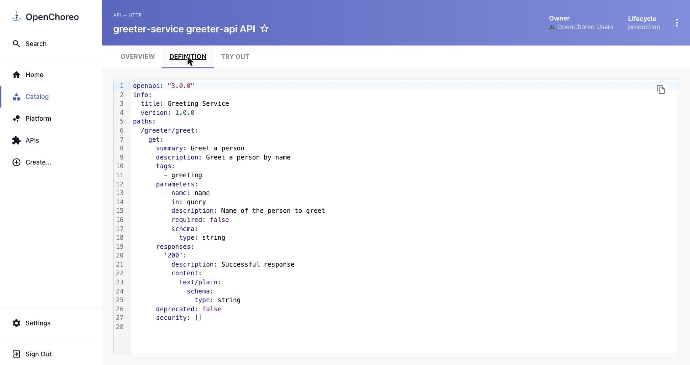

Grab the endpoint URL from **DEPLOY → Development → Endpoints** (use the copy button next to the
**External** URL). In this workshop's k3d setup it looks like:

```
http://development-default.openchoreoapis.localhost:19080/greeter-service-greeter-api
```

Call the greeter — in your browser or with `curl`:

```bash
BASE="http://development-default.openchoreoapis.localhost:19080/greeter-service-greeter-api"

curl "${BASE}/greeter/greet?name=SLT"
# Hello, SLT!

curl "${BASE}/greeter/greet"
# Hello, Stranger!
```

Opened in the browser, `…/greeter/greet?name=SLT` returns:


> Prefer to discover the URL from `kubectl`? The host and path prefix live on the generated
> `HTTPRoute`:
> ```bash
> kubectl get httproute -A -l openchoreo.dev/component=greeter-service \
>   -o jsonpath='{.items[0].spec.hostnames[0]}{.items[0].spec.rules[0].matches[0].path.value}{"\n"}'
> ```
> Prefix that with `http://` and `:19080`, then append `/greeter/greet`.

### Verify this step

```bash
kubectl wait --for=condition=available deployment \
  -l openchoreo.dev/component=greeter-service -A --timeout=120s

curl -s "http://development-default.openchoreoapis.localhost:19080/greeter-service-greeter-api/greeter/greet?name=SLT"
# Expected: Hello, SLT!
```

---

## What you did

- Created a **Service** component in the console and pointed it at a Git repo.
- Let OpenChoreo **build the image from source** in-cluster from the project's `Dockerfile`, with no
  Docker on your laptop and no image registry of your own.
- Snapshotted the build as an immutable **release** and **deployed** it to Development.
- Reached the running service over its **external HTTP endpoint**.

The same component page is your jumping-off point for the rest of the platform: **LOGS** (runtime
logs via OpenObserve), **METRICS**, and **Promote** to push this release on to Staging and
Production.

## Clean up (optional)

To remove just this scenario's component (leaves the rest of the environment intact):

```bash
kubectl delete component.openchoreo.dev greeter-service -n default
```

Or use **DEPLOY → Development → Danger zone** in the console. To tear down the whole environment,
see [Step 8 — Cleanup](../../installation/08-cleanup.md).

---

Next: [Back to the scenarios index »](../README.md)
