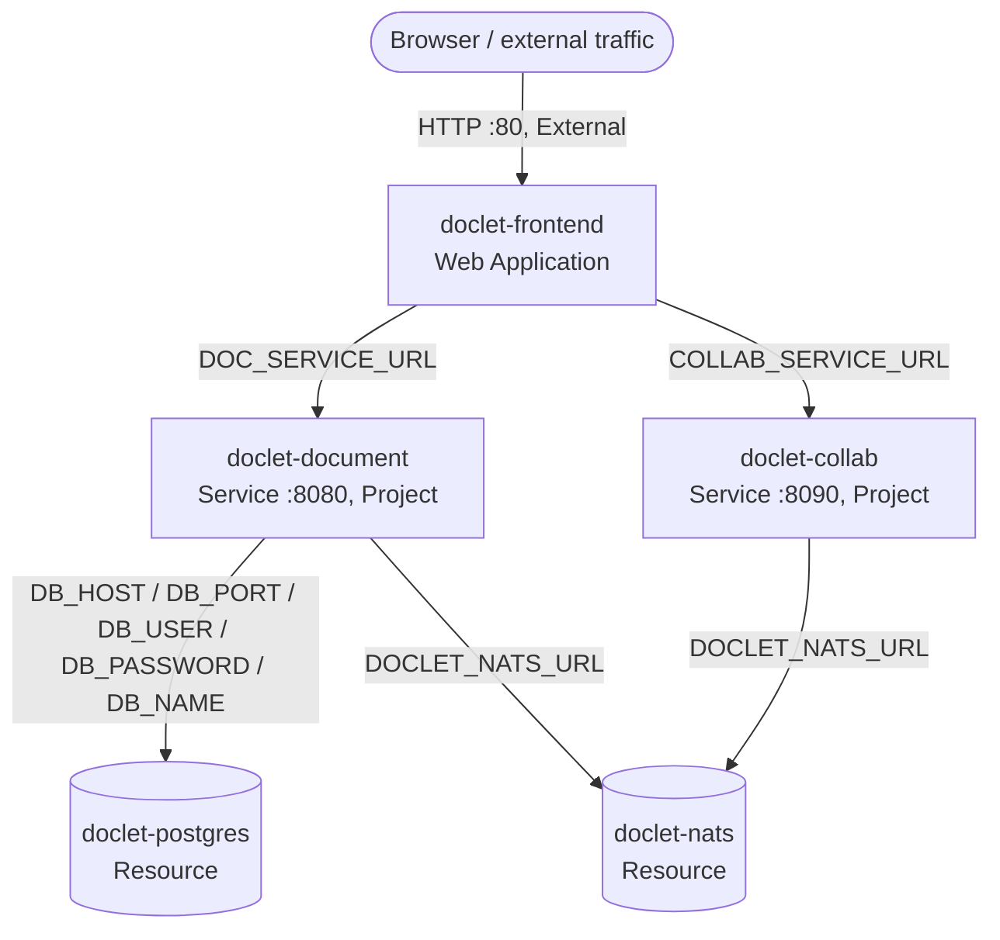
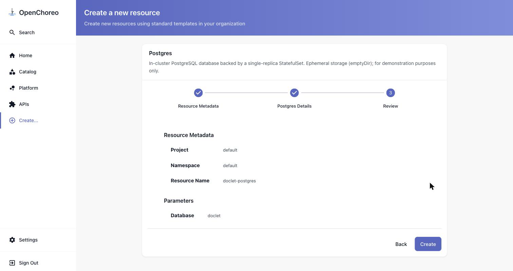
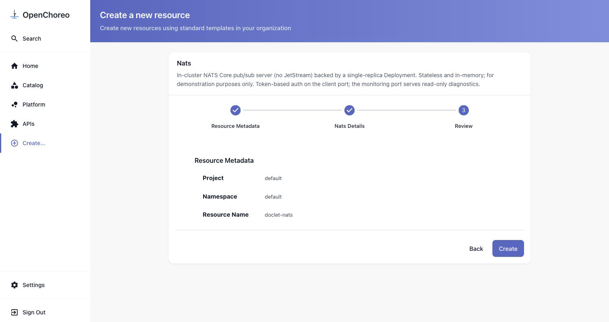
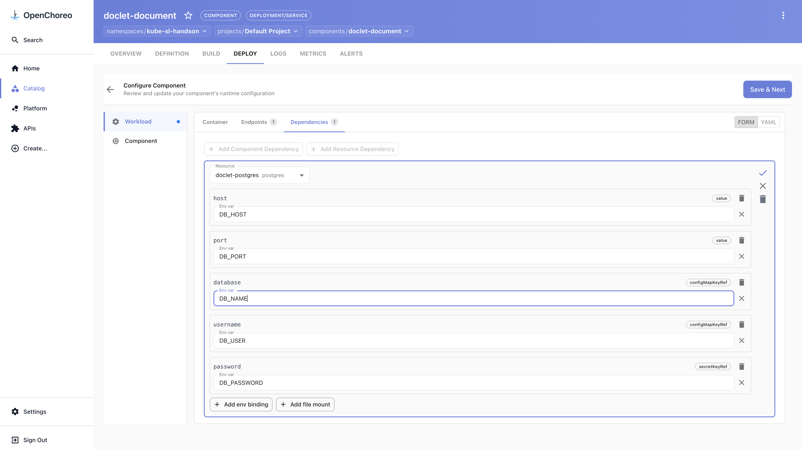
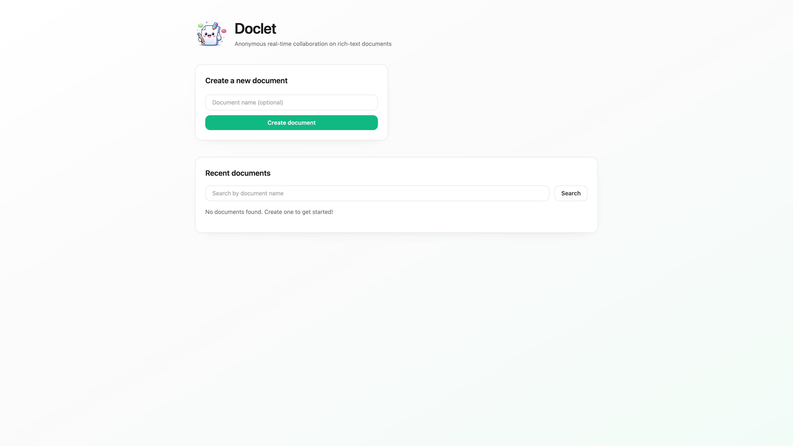
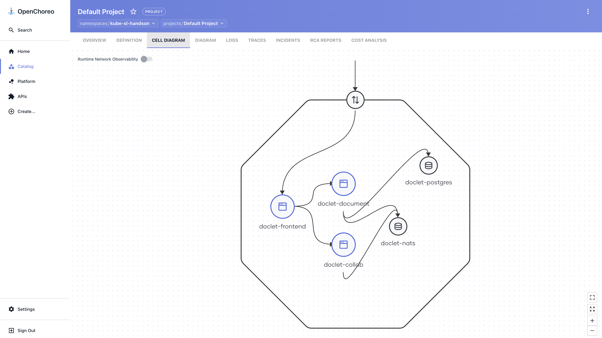

# Scenario 2 — A multi-service app with self-service infra

**~25 minutes · no YAML, no local container build**

**Doclet** is a real collaborative document editor: a React frontend, two Go services, and managed
**Postgres** and **NATS**. This scenario covers the two things a single-component deploy can't show —
provisioning your own infrastructure on demand, and wiring several components together — all in the
OpenChoreo console, **Development only** (no promotion).



---

## Before you start

- You have completed the [installation guide](../../installation/README.md) and all four planes are
  running.
- You can open the developer console and sign in (see
  [Step 7 — Verify](../../installation/07-verify.md#71-log-in-to-the-openchoreo-console)):
  - **URL:** <http://openchoreo.localhost:8080>
  - **Username:** `admin@openchoreo.dev`
  - **Password:** `Admin@123`

> **Everything goes into the same namespace and project** (in this workshop: namespace `default`,
> project `default`). All five pieces must land there, or the dependency pickers later won't find
> them. Each **Create** wizard pre-selects `default` / `default` — just confirm those are right
> before continuing.

**Order matters.** A component can only wire to things that already exist, so build bottom-up:
resources → the services that use them → the frontend that uses the services.

### What we'll build

| Component | Type | Image | Endpoint |
|---|---|---|---|
| `doclet-postgres` | Resource (Postgres) | — | parameter `database = doclet` |
| `doclet-nats` | Resource (Nats) | — | — |
| `doclet-document` | Service | `ghcr.io/openchoreo/samples/doclet-document:latest` | HTTP `8080`, Project |
| `doclet-collab` | Service | `ghcr.io/openchoreo/samples/doclet-collab:latest` | HTTP `8090`, Project |
| `doclet-frontend` | Web Application | `ghcr.io/openchoreo/samples/doclet-frontend:latest` | HTTP `80`, External |

---

## Step 1 — Provision the managed resources

### Postgres

1. Sidebar → **Create…** → **Resource** → **Postgres**.
2. **Namespace** and **Project** stay `default`. **Resource Name:** `doclet-postgres`. Click **Next**.
3. On **Postgres Details**, set **database** = `doclet`. Click **Review**, confirm the summary, then
   **Create**.



4. Open the resource → **DEPLOY** tab → **Set up** → **Configure & Deploy** → **Next** → **Deploy**.
   Wait for **Development** to show **Active**.

### NATS

Same flow, with no parameters to set:

1. **Create…** → **Resource** → **Nats**. **Resource Name:** `doclet-nats`. Click **Next** →
   (*Nats has no configurable parameters*) → **Review** → **Create**.



2. Open it → **DEPLOY** → **Set up** → **Configure & Deploy** → **Next** → **Deploy**. Wait for
   **Development** to show **Active**.

Both resources are now running in Development with generated credentials.

### Verify this step

```bash
kubectl get resource.openchoreo.dev -n default | grep doclet
# doclet-postgres and doclet-nats should both be listed
```

---

## Step 2 — Deploy the document service (uses Postgres + NATS)

1. **Create…** → **Component** → **Service**. **Name:** `doclet-document`. Click **Next**.
2. **Build & Deploy:** select **Container Image** and set it to
   `ghcr.io/openchoreo/samples/doclet-document:latest`. Leave **Auto Deploy** off (you'll wire
   dependencies first). Click **Next**.
3. **Service Details:** **Add Endpoint** → port `8080`, **uncheck External** (Project-only).
   **Apply changes**. **Review** → **Create**.
4. Open the component → **DEPLOY** → **Set up** → **Configure & Deploy** → open the **Dependencies**
   tab.
5. **Add Resource Dependency** → select `doclet-postgres`, then **Add env binding** for each output:

   | Output | Env var |
   |---|---|
   | host | `DB_HOST` |
   | port | `DB_PORT` |
   | username | `DB_USER` |
   | password | `DB_PASSWORD` |
   | database | `DB_NAME` |

   **Apply changes**. (The output picker also lists `url`, `adminURL`, and `adminPassword` — ignore
   those; you only need the five above.)

   

6. **Add Resource Dependency** again → `doclet-nats` → bind **url** → `DOCLET_NATS_URL`.
   **Apply changes**.
7. **Save & Next** → **Save & Continue** → **Deploy**. The service starts and connects to the
   database.

---

## Step 3 — Deploy the collab service (uses NATS)

1. **Create…** → **Component** → **Service**. **Name:** `doclet-collab`, image
   `ghcr.io/openchoreo/samples/doclet-collab:latest`, **Auto Deploy** off. Click **Next**.
2. **Add Endpoint** → change the port from `8080` to `8090`, **uncheck External**. **Apply changes**.
   **Review** → **Create**.
3. Open it → **DEPLOY** → **Set up** → **Configure & Deploy** → **Dependencies**.
4. **Add Resource Dependency** → `doclet-nats` → bind **url** → `DOCLET_NATS_URL`. **Apply changes**.
5. **Save & Next** → **Save & Continue** → **Deploy**.

---

## Step 4 — Deploy the frontend (uses both services)

1. **Create…** → **Component** → **Web Application**. **Name:** `doclet-frontend`, image
   `ghcr.io/openchoreo/samples/doclet-frontend:latest`, **Auto Deploy** off. Click **Next**.
2. **Add Endpoint** → change the port from `8080` to `80`, keep **External** checked (this is the
   public UI). **Apply changes**. **Review** → **Create**.
3. Open it → **DEPLOY** → **Set up** → **Configure & Deploy** → **Dependencies**.
4. **Add Component Dependency** → Component `doclet-document`, Endpoint `endpoint-1`, Visibility
   `Project`, **Address Env Var** = `DOC_SERVICE_URL`. **Apply changes**.
5. **Add Component Dependency** → Component `doclet-collab`, Endpoint `endpoint-1`, Visibility
   `Project`, **Address Env Var** = `COLLAB_SERVICE_URL`. **Apply changes**.
6. **Save & Next** → **Save & Continue** → **Deploy**.

---

## Step 5 — Open your app

1. On the frontend's **DEPLOY** tab, select **Development** and click the **External** endpoint URL.
   Doclet opens — create and edit a document.

   

2. Open the **project** (breadcrumb → your project) and the **Cell Diagram** tab to see the whole
   thing wired together: external traffic → frontend → the two services → Postgres and NATS.

   

### Verify this step

```bash
kubectl wait --for=condition=available deployment \
  -l openchoreo.dev/component=doclet-frontend -A --timeout=120s
```

---

## What you did

- Provisioned two managed resources (**Postgres**, **NATS**) on demand — no tickets, no YAML.
- Deployed three components and wired them to resources (env-var bindings) and to each other
  (endpoint dependencies), entirely in the portal.
- Stood up a real multi-service application in your namespace, Development only.

The deployable sample also lives in the OpenChoreo repo at `samples/from-image/doclet/` if you'd
rather read the full resource model in YAML.

## Clean up (optional)

To remove just this scenario's components and resources (leaves the rest of the environment intact):

```bash
kubectl delete component.openchoreo.dev doclet-frontend doclet-collab doclet-document -n default
kubectl delete resource.openchoreo.dev doclet-postgres doclet-nats -n default
```

To tear down the whole environment, see [Step 8 — Cleanup](../../installation/08-cleanup.md).

---

Next: [Back to the scenarios index »](../README.md)
