# Scenario 3 — One service, two doors: external and internal endpoints

**~15 minutes · no YAML, no local container build**

The same service can be published at more than one **visibility** level at once. In this scenario you
deploy the **Go greeter** from a published image, expose its single port `9090` as both an
**External** and an **Internal** endpoint, attach the service's **OpenAPI schema**, and then call it
straight from the console's **Try Out** page — no `curl`, no port-forward.

Visibility is what decides *who can reach the endpoint* and *through which gateway*:

| Visibility | Reachable from | Goes through |
|---|---|---|
| **Project** (always on) | other components in the same project | the `ClusterIP` Service — in-cluster only |
| **Internal** | anywhere inside the cluster / organization | the internal gateway (`gateway-internal`) |
| **External** | outside the cluster — your laptop | the external gateway (`gateway-default`) |

(The **Namespace** box is left unticked here: on OpenChoreo `1.2.0-rc.1` the `service` component type
only renders gateway routes for *external* and *internal*.)

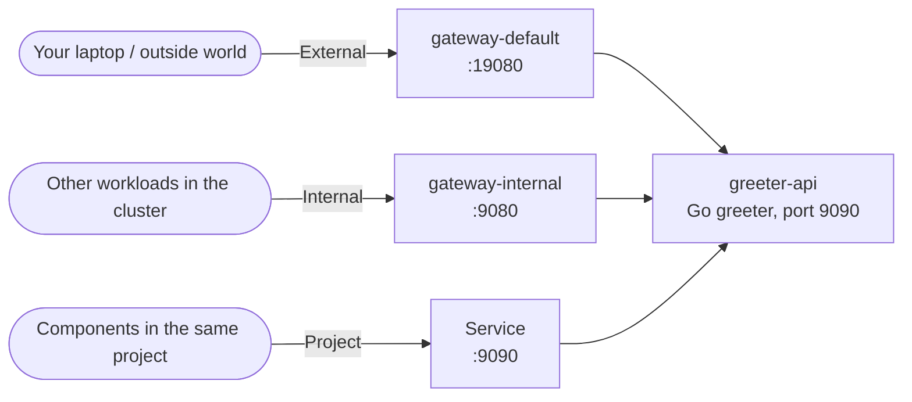

---

## Before you start

- You have completed the [installation guide](../../installation/README.md) and all four planes are
  running. Scenarios 1 and 2 are **not** required.
- You can open the developer console and sign in (see
  [Step 7 — Verify](../../installation/07-verify.md#71-log-in-to-the-openchoreo-console)):
  - **URL:** <http://openchoreo.localhost:8080>
  - **Username:** `admin@openchoreo.dev`
  - **Password:** `Admin@123`

> Everything goes into namespace `default` / project `default` — the values each **Create** wizard
> pre-selects.

### What we'll build

| Field | Value |
|-------|-------|
| Component name | `greeter-api` |
| Type | **Service** (`deployment/service`) |
| Deployment source | **Container Image** |
| Image | `ghcr.io/openchoreo/samples/greeter-service:latest` |
| Auto Deploy | **on** (deploys to Development as soon as it's created) |
| Endpoint name | `greeter` |
| Endpoint | HTTP, port `9090`, visibility **External + Internal** |
| Schema | [`service-go-greeter/openapi.yaml`](https://github.com/openchoreo/sample-workloads/blob/main/service-go-greeter/openapi.yaml) |

---

## Step 1 — Create the component

1. Sidebar → **Create…** → **Component** → **Service**
   (*"A long-running request-serving component with one or more endpoints"*).
2. **Namespace** and **Project** stay `default`. **Component Name:** `greeter-api`. Leave display
   name and description empty. Click **Next**.

   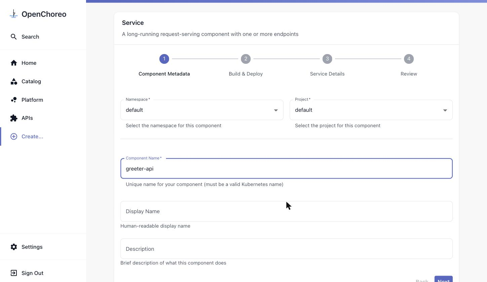

3. On **Build & Deploy**, choose **Container Image** and set it to
   `ghcr.io/openchoreo/samples/greeter-service:latest`. Turn **Auto Deploy** **on** — there are no
   dependencies to wire, so the component can go straight to Development. Click **Next**.

   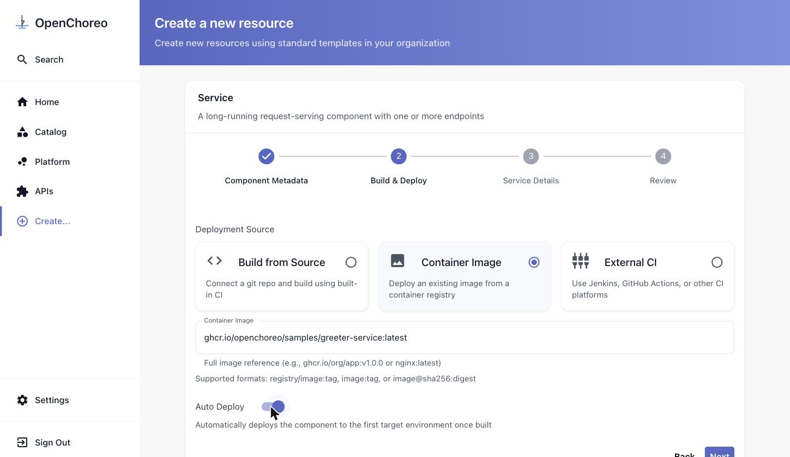

## Step 2 — Add the endpoint with two visibilities

On **Service Details**, click **Add Endpoint** and fill it in:

1. **Endpoint Name:** `greeter`
2. **Type:** `HTTP`, **Port:** `9090` (the port the greeter listens on — change it from the default
   `8080`)
3. **Visibility:** tick **Internal** and leave **External** ticked. **Project** is always on and
   can't be unticked; leave **Namespace** off.

   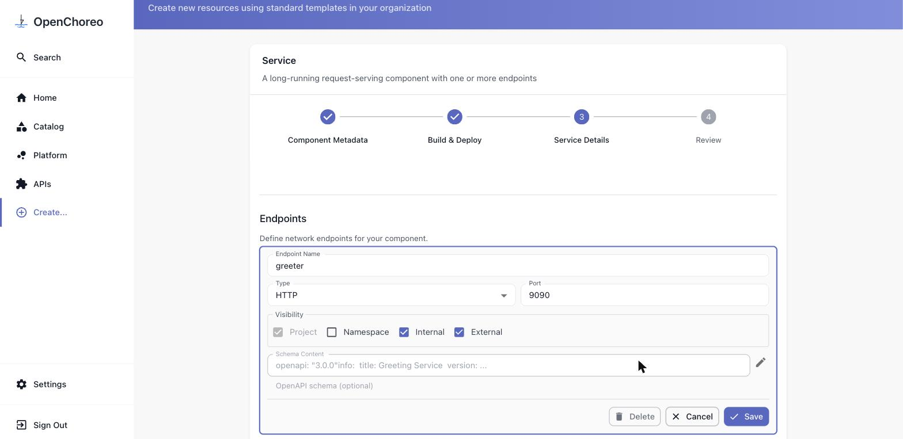

4. **Schema Content:** click the pencil icon on the right to open the editor and paste the greeter's
   OpenAPI definition — copy it from
   [`openapi.yaml`](https://raw.githubusercontent.com/openchoreo/sample-workloads/main/service-go-greeter/openapi.yaml)
   (or run `curl -fsSL https://raw.githubusercontent.com/openchoreo/sample-workloads/main/service-go-greeter/openapi.yaml | pbcopy`).
   Click **Apply**.

   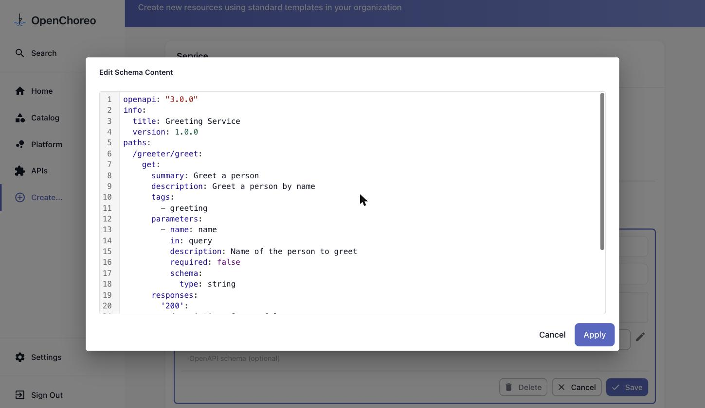

   > The schema is optional for deployment, but it's what makes the **API** tab and the **Try Out**
   > page in [step 5](#step-5--call-it-from-try-out) work.

5. Click **Save**. The endpoint collapses to a one-line summary — check it reads
   `greeter HTTP : 9090 · Project, External, Internal`. If a leftover `endpoint-1 HTTP : 8080` row is
   also listed, **Delete** it.

   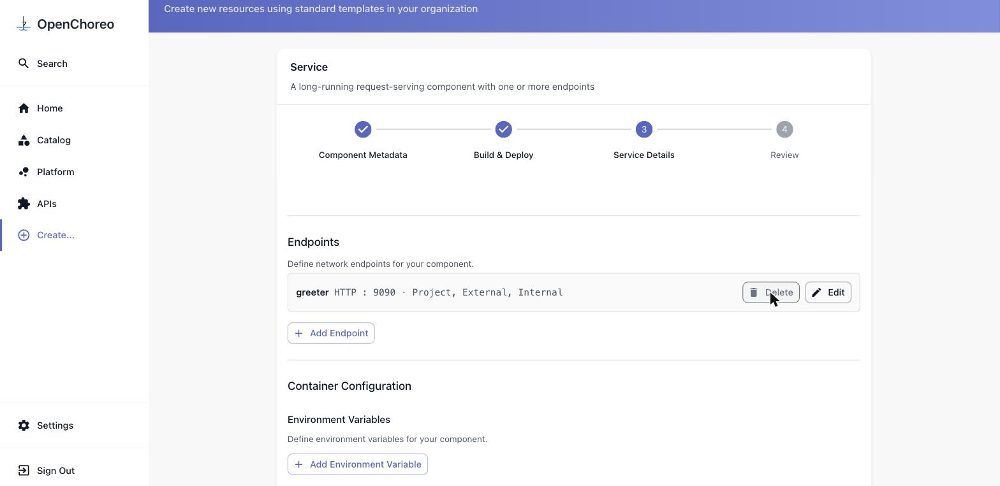

6. Leave **Container Configuration** empty and click **Review**.

## Step 3 — Create and let it deploy

Check the summary — image, **Auto Deploy: Yes**, and `Greeter  HTTP, port 9090 (external, internal)`
— then click **Create**.

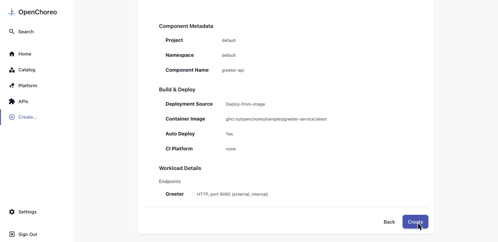

When the task finishes, click **View Component** → **DEPLOY**. Because Auto Deploy is on, the
**Development** environment goes to **Active** on its own after a few seconds (no *Configure &
Deploy* needed).

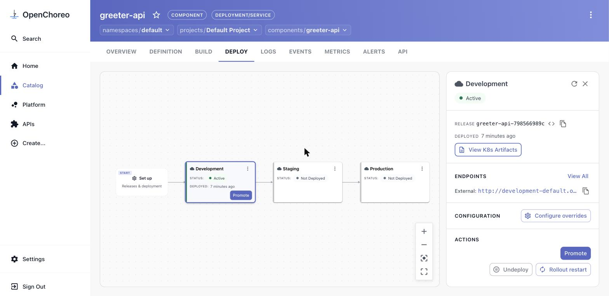

### Verify this step

```bash
kubectl wait --for=condition=available deployment \
  -l openchoreo.dev/component=greeter-api -A --timeout=180s
```

## Step 4 — See the two URLs

In the **Development** panel on the right, next to **ENDPOINTS**, click **View All**. One endpoint,
three addresses — one per visibility level:

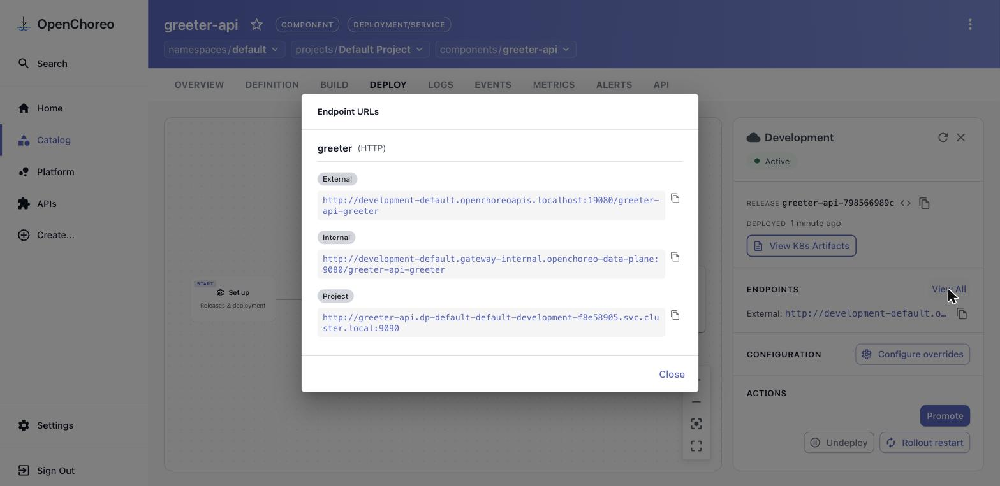

| Visibility | URL |
|---|---|
| **External** | `http://development-default.openchoreoapis.localhost:19080/greeter-api-greeter` |
| **Internal** | `http://development-default.gateway-internal.openchoreo-data-plane:9080/greeter-api-greeter` |
| **Project** | `http://greeter-api.dp-default-default-development-<hash>.svc.cluster.local:9090` |

The path prefix is `/<component>-<endpoint>`, and the hostname encodes
`<environment>-<project>` — that's how one gateway serves every component in the cluster. Ticking
**Internal** is what created the second route; without it you'd only get the external one:

```bash
kubectl get httproute -A -l openchoreo.dev/component=greeter-api \
  -o custom-columns='NAME:.metadata.name,GATEWAY:.spec.parentRefs[*].name,HOST:.spec.hostnames'
# greeter-api-greeter-ce4b6b1d            gateway-default    [development-default.openchoreoapis.localhost]
# greeter-api-greeter-internal-e13bba9e   gateway-internal   [development-default.gateway-internal.openchoreo-data-plane]
```

## Step 5 — Call it from Try Out

1. Open the component's **API** tab → click **greeter-api greeter API** under *Provided APIs*.
2. The **DEFINITION** tab shows the schema you pasted, rendered from the catalog.

   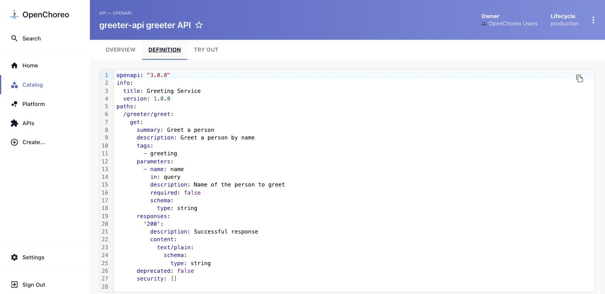

3. Switch to **TRY OUT**. The console picks up the **External** URL for the selected environment
   automatically — this only works because the endpoint is externally visible; your browser is
   outside the cluster. (The external route also carries a CORS filter, which is what lets the
   console page call it directly.)

   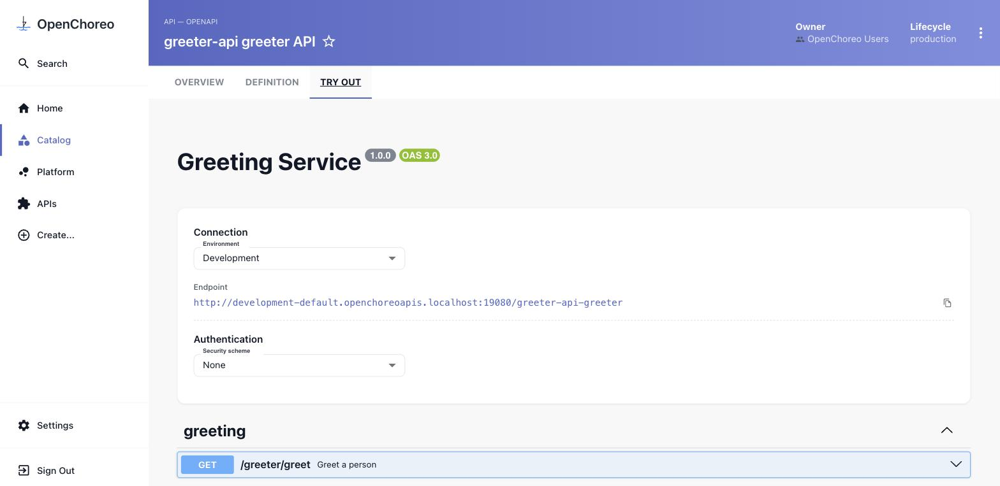

4. Expand **GET /greeter/greet** → **Try it out** → type `OpenChoreo` in the **name** field →
   **Execute**. You get `200` and `Hello, OpenChoreo!`.

   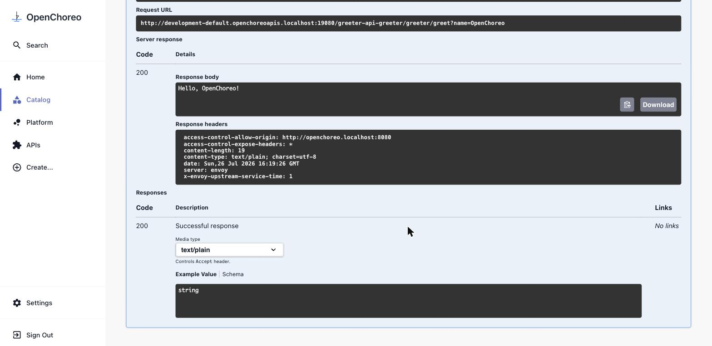

## Step 6 — Prove the difference

The external URL works from your machine:

```bash
curl "http://development-default.openchoreoapis.localhost:19080/greeter-api-greeter/greeter/greet?name=OpenChoreo"
# Hello, OpenChoreo!
```

The internal one does **not** — its hostname only resolves inside the cluster:

```bash
curl -m 5 "http://development-default.gateway-internal.openchoreo-data-plane:9080/greeter-api-greeter/greeter/greet"
# curl: (6) Could not resolve host: development-default.gateway-internal.openchoreo-data-plane
```

Call it from a throwaway pod inside the cluster instead, and it answers:

```bash
kubectl run curl-test --rm -i --restart=Never --image=curlimages/curl:latest -n default -- \
  -s -H "Host: development-default.gateway-internal.openchoreo-data-plane" \
  "http://gateway-internal.openchoreo-data-plane:9080/greeter-api-greeter/greeter/greet?name=Internal"
# Hello, Internal!
```

That's the whole point of visibility: the same container, published once, reachable through a public
door for outside consumers and a private door for other workloads in your organization.

---

## What you did

- Deployed a service from a published image with **Auto Deploy** — no build, no YAML.
- Published a single port at **two visibility levels** at once, and saw the two HTTPRoutes (external
  and internal gateway) OpenChoreo generated for it.
- Attached an **OpenAPI schema** to the endpoint, which registered the service in the catalog's API
  list and enabled the console's **Try Out** page.
- Called the live API from the console and confirmed from the shell that the internal address really
  is internal.

## Clean up (optional)

```bash
kubectl delete component.openchoreo.dev greeter-api -n default
```

To tear down the whole environment, see [Step 8 — Cleanup](../../installation/08-cleanup.md).

---

Next: [Back to the scenarios index »](../README.md)
