# Scenario 4 — Put an API gateway in front: auth, rate limiting, response headers

**~20 minutes · no YAML, no redeploy of your code**

The greeter from [scenario 3](../03-endpoint-visibility/README.md) is wide open: anyone who can reach
the external URL can call it as often as they like. In this scenario you attach the
**`api-management` trait** to it and get three things without touching the service:

| Policy | What you configure | What it does |
|---|---|---|
| **JWT auth** | `jwtAuth.enabled = true` | Rejects requests without a valid bearer token (`401`) |
| **Rate limit** | `3` requests per `1m` | Rejects the 4th request in a minute (`429`) |
| **Response headers** | `x-powered-by: OpenChoreo` | Adds the header to every response |

A trait is a **cross-cutting concern** you bolt onto a component. Attaching this one makes OpenChoreo
re-point the component's HTTPRoutes at the platform's API gateway and register the API there, so
policies run at the edge — the container keeps serving plain HTTP on `9090` and never sees the
difference.

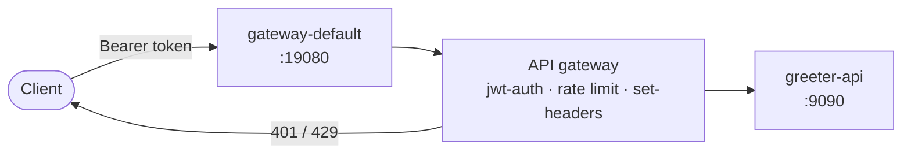

---

## Before you start

- You have completed [scenario 3](../03-endpoint-visibility/README.md) — the `greeter-api` component
  is deployed to **Development** and its external endpoint answers.
- You can open the developer console and sign in:
  - **URL:** <http://openchoreo.localhost:8080>
  - **Username:** `admin@openchoreo.dev`
  - **Password:** `Admin@123`

The workshop's identity provider (**Thunder**) ships with a pre-registered client-credentials
application you'll use to get tokens:

| Setting | Value |
|---|---|
| Token endpoint | `http://thunder.openchoreo.localhost:8080/oauth2/token` |
| Client ID | `customer-portal-client` |
| Client secret | `supersecret` |

> The API gateway trusts exactly this issuer — it validates tokens against Thunder's JWKS
> (`issuer: http://thunder.openchoreo.localhost:8080`). A token from anywhere else is rejected.

---

## Step 1 — Open the component's trait configuration

1. Go to **Catalog** → **greeter-api** → **DEPLOY**.
2. Click the **Set up** card at the start of the pipeline, then **Configure & deploy**.
3. In the left rail of *Configure component*, switch from **Workload** to **Component**. You land on
   **Traits** — empty for now.

   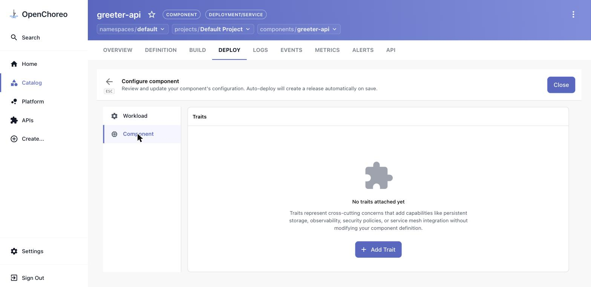

4. Click **Add Trait** → select **api-management (Cluster)**. Leave the instance name
   `api-management-1`.

## Step 2 — Configure the three policies

The parameters render as a form (there's a **FORM / YAML** toggle in the top-right if you'd rather
type it).

**Add Headers**

1. Tick **Enabled**.
2. **Add Response Header** → **Name:** `x-powered-by`, **Value:** `OpenChoreo` → confirm with the ✓.

   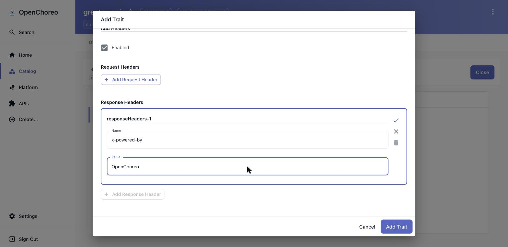

**JWT Auth**

3. Tick **Enabled**.

**Rate Limit**

4. Tick **Enabled**, then **Add Limit** → **Duration:** `1m`, **Requests:** `3` → confirm with the ✓.

   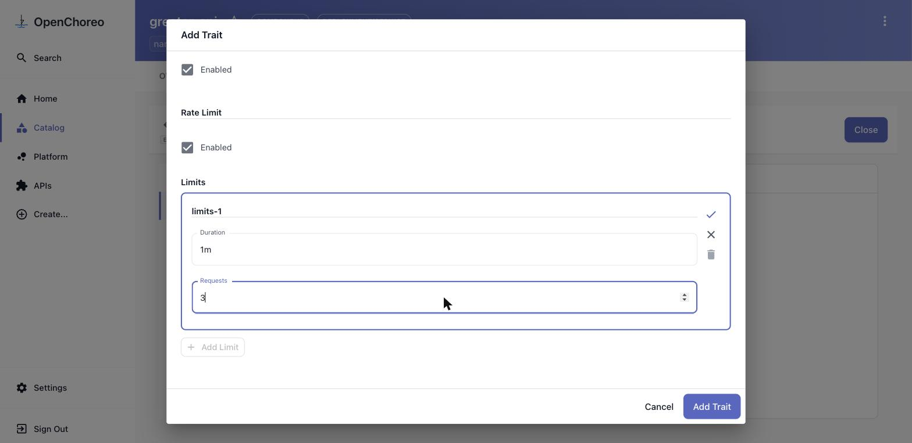

Flip to **YAML** to check the whole thing reads:

```yaml
addHeaders:
  enabled: true
  requestHeaders: []
  responseHeaders:
    - name: x-powered-by
      value: OpenChoreo
jwtAuth:
  enabled: true
rateLimit:
  enabled: true
  limits:
    - duration: 1m
      requests: 3
```

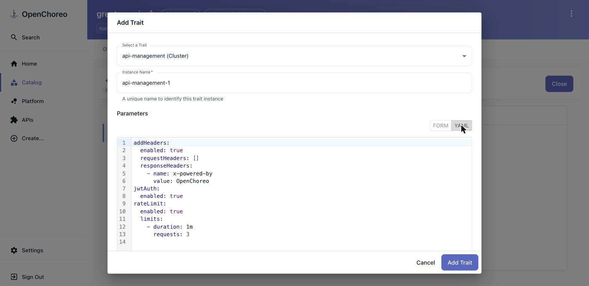

5. Click **Add Trait**. The trait appears in the list marked **ADDED** — it isn't live yet.

   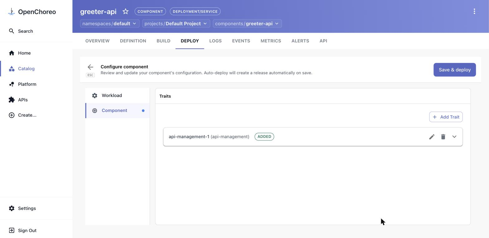

## Step 3 — Save and roll it out

Click **Save & deploy**. The confirmation dialog summarises the change and reminds you that
auto-deploy will roll it out immediately.

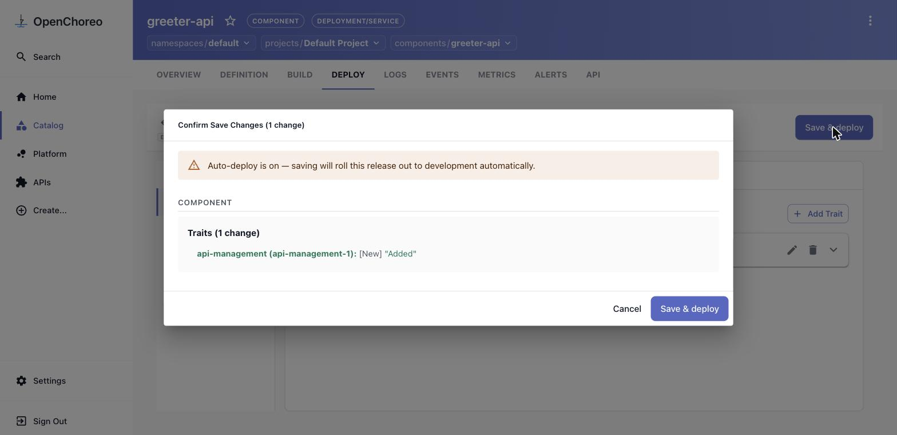

Confirm. A new release is created and Development goes back to **Active** within a few seconds.

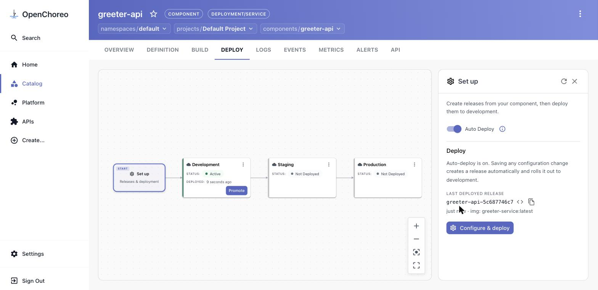

### Verify this step

The trait creates a `RestApi` (registered on the API gateway) plus a `Backend`, and re-points the
component's HTTPRoutes at that gateway instead of the pod:

```bash
kubectl get restapis.gateway.api-platform.wso2.com -A
kubectl get httproute -A -l openchoreo.dev/component=greeter-api \
  -o custom-columns='NAME:.metadata.name,BACKEND:.spec.rules[0].backendRefs[*].name'
# greeter-api-greeter-ce4b6b1d            greeter-api-api-gw-backend
# greeter-api-greeter-internal-e13bba9e   greeter-api-api-gw-backend
```

> **Both** routes are patched — the internal endpoint from scenario 3 is now behind JWT too. The
> trait applies to the component, not to one visibility level.

## Step 4 — The API is now closed

Go to **API** → **greeter-api greeter API** → **TRY OUT**, leave **Security scheme** on `None`,
expand **GET /greeter/greet** → **Try it out** → **Execute**.

`401 Unauthorized` — `{"error": "Unauthorized", "message": "Authentication failed."}`.

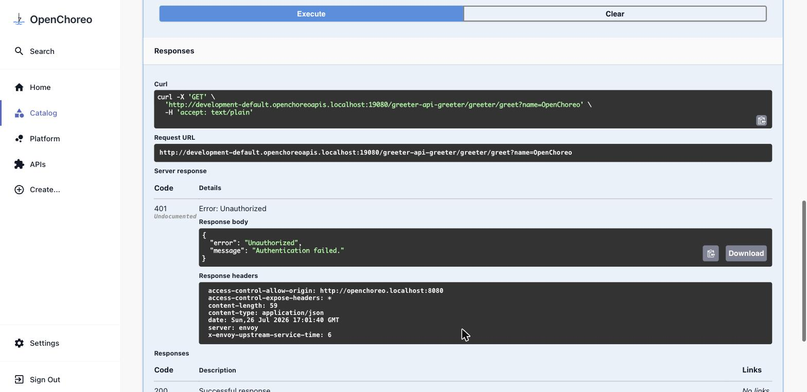

## Step 5 — Call it with a token

1. Back in the **Connection** panel, set **Security scheme** to **OAuth2 (Client Credentials)** and
   fill in the Thunder details from [Before you start](#before-you-start):

   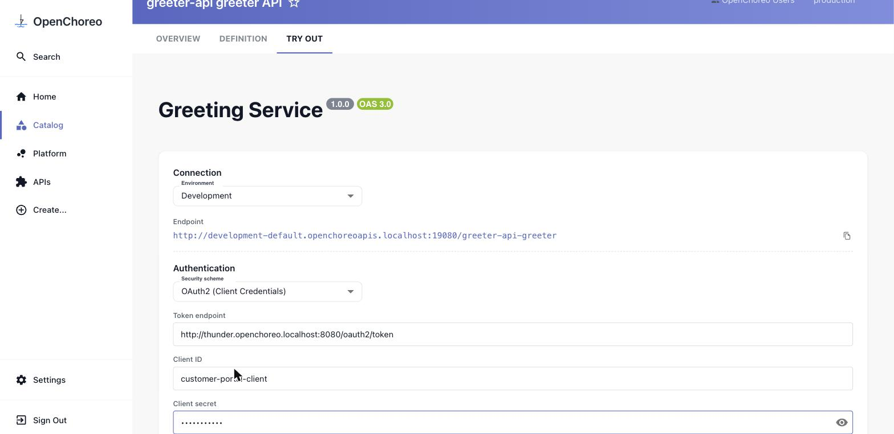

2. Click **Get token** → *"Token acquired — it will be sent as a Bearer token with requests."*

   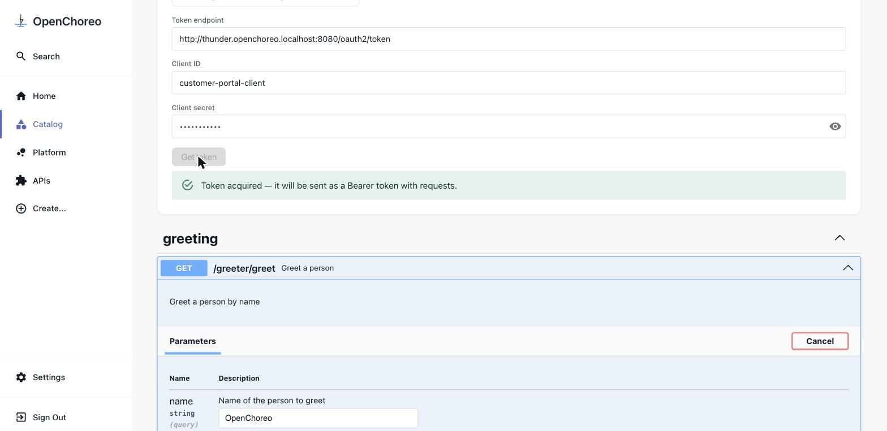

3. **Execute** again. `200`, `Hello, OpenChoreo!` — and look at the response headers:

   ```
   x-powered-by: OpenChoreo
   x-ratelimit-limit: 3
   x-ratelimit-remaining: 2
   ratelimit-policy: "default";q=3;w=60
   ```

   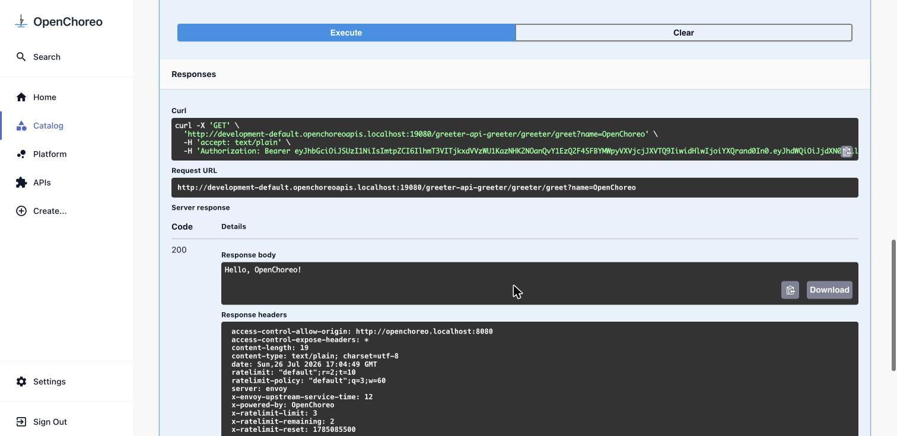

   All three policies are visible in one response: the request was authenticated, the header was
   injected, and the gateway is counting.

## Step 6 — Trip the rate limit

Click **Execute** four times in quick succession. The first three succeed (`remaining` counts
`2 → 1 → 0`); the fourth gets **`429 Too Many Requests`** with
`{"error": "Too Many Requests", "message": "Rate limit exceeded. Please try again later."}`.

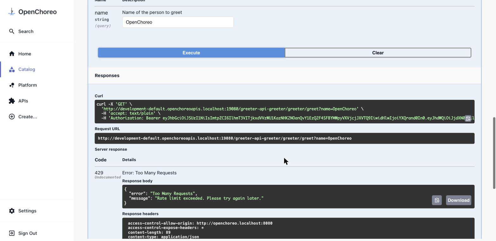

Wait out the rest of the minute (`retry-after` tells you how long) and it starts answering again.

### The same thing from the shell

```bash
URL="http://development-default.openchoreoapis.localhost:19080/greeter-api-greeter/greeter/greet?name=OpenChoreo"

# No token → 401
curl -s -o /dev/null -w '%{http_code}\n' "$URL"

# Get a token from Thunder
TOKEN=$(curl -s -X POST http://thunder.openchoreo.localhost:8080/oauth2/token \
  -d 'grant_type=client_credentials&client_id=customer-portal-client&client_secret=supersecret' \
  | python3 -c 'import json,sys; print(json.load(sys.stdin)["access_token"])')

# With a token → 200 + the injected header
curl -s -i -H "Authorization: Bearer $TOKEN" "$URL" | grep -iE '^(HTTP|x-powered-by|x-ratelimit)'

# Four in a row → the last one is 429
for i in 1 2 3 4; do
  curl -s -o /dev/null -w "req $i: %{http_code}\n" -H "Authorization: Bearer $TOKEN" "$URL"
done
```

---

## What you did

- Attached the **`api-management` trait** to a running component from the console — no change to the
  service, no new YAML file.
- Turned on **JWT authentication** (validated against the workshop's Thunder IdP), a **3 requests
  per minute** limit, and a **`x-powered-by: OpenChoreo`** response header.
- Watched OpenChoreo re-point the component's HTTPRoutes at the platform API gateway and register a
  `RestApi` for it.
- Exercised all three policies from the console's **Try Out** page — `401`, `200` with the injected
  headers, and `429`.

## Clean up (optional)

To drop the policies but keep the service, reopen **Set up → Configure & deploy → Component**,
delete the `api-management-1` trait with the 🗑 icon, and **Save & deploy**. The routes go straight
back to the pod.

To remove the component entirely:

```bash
kubectl delete component.openchoreo.dev greeter-api -n default
```

---

Next: [Back to the scenarios index »](../README.md)
