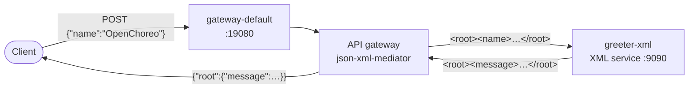
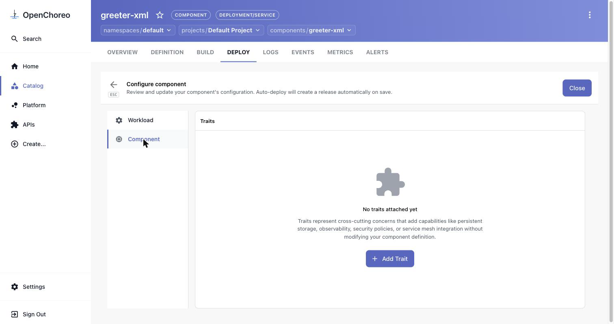
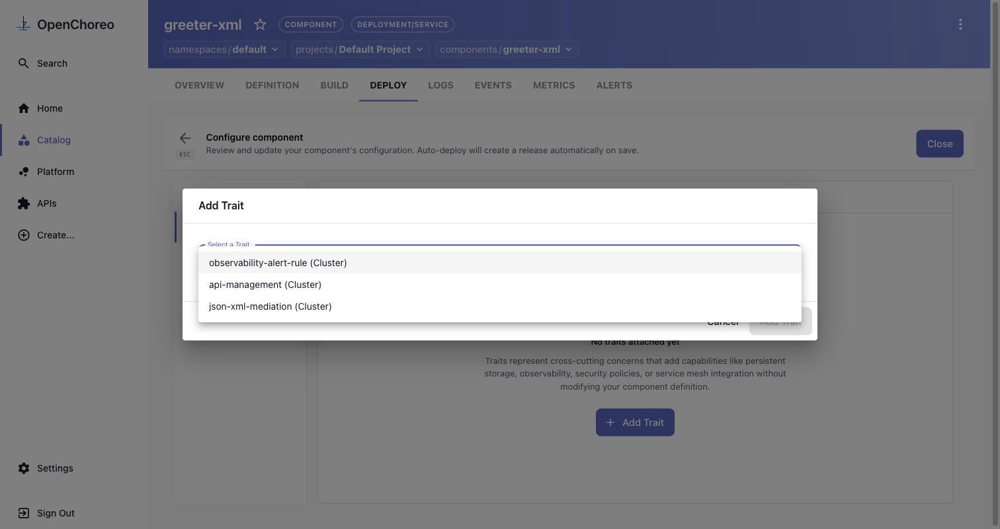
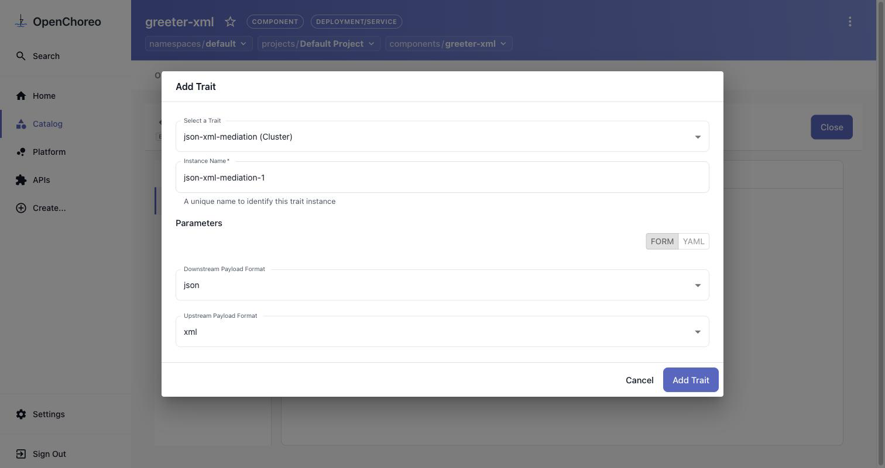
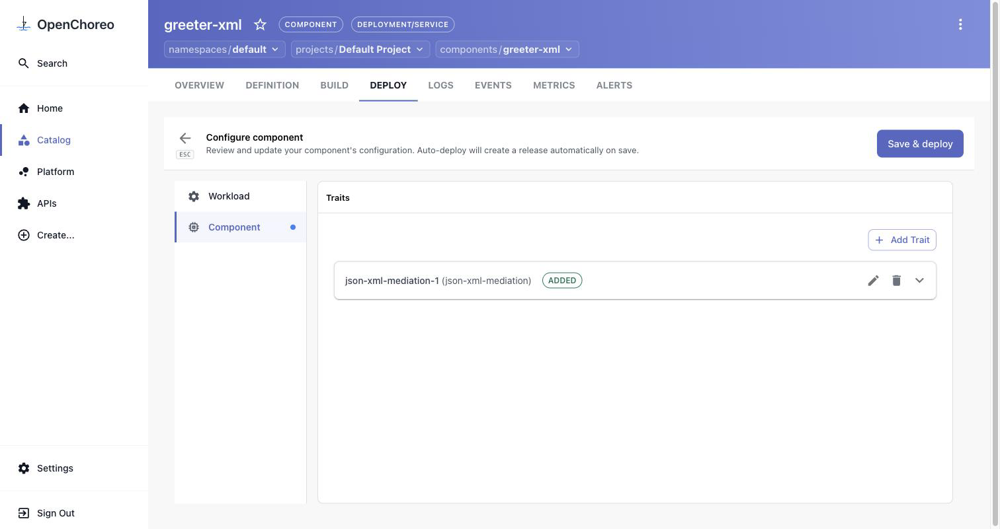
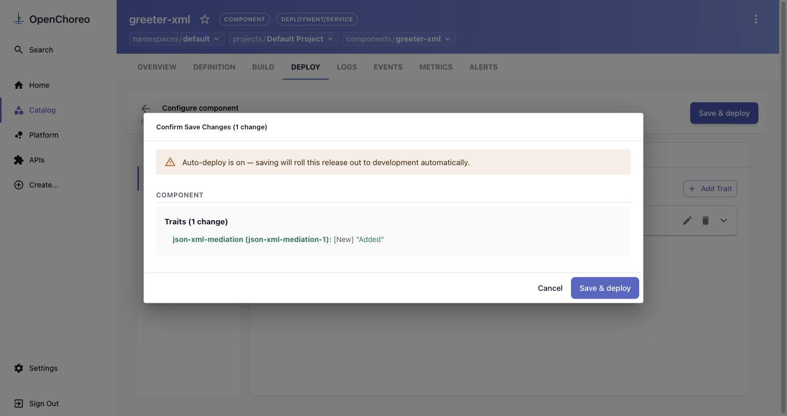
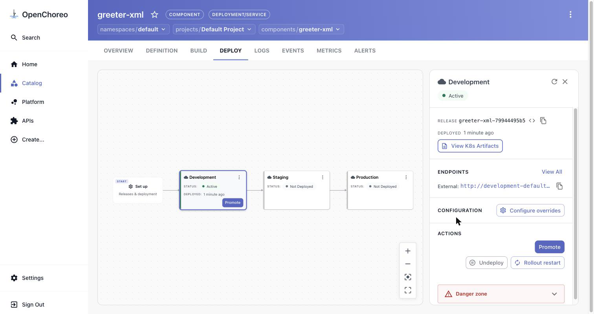

# Scenario 5 — Speak JSON to an XML service: request/response mediation

**~20 minutes · no change to the service, no redeploy of your code**

Plenty of real backends only speak XML. Consumers — browsers, mobile apps, other teams — want
JSON. In this scenario you put the platform's API gateway in front of an XML-only service and let
it translate **both directions**: JSON in from the client becomes XML for the service, and the
service's XML answer comes back as JSON.

The translation is a **policy on the gateway**, configured through a trait with two dropdowns:

| Parameter | Value | Meaning |
|---|---|---|
| **Upstream Payload Format** | `xml` | what the container behind the gateway speaks |
| **Downstream Payload Format** | `json` | what clients speak to the gateway |

The container keeps serving XML on port `9090` and never learns that anything changed.



Unlike [scenario 4](../04-api-management/README.md), the trait used here is **not** part of the
stock install — you publish it yourself first. That is the other half of this scenario: how a
platform engineer turns a gateway policy into a self-service option developers can pick from the
console.

---

## Before you start

- You have completed the [installation guide](../../installation/README.md) and all four planes are
  running. Scenario 4 is **not** required, but it uses the same API gateway, so its
  [Step 3 verification](../04-api-management/README.md#verify-this-step) is a good sanity check that
  the gateway is healthy.
- You can open the developer console and sign in:
  - **URL:** <http://openchoreo.localhost:8080>
  - **Username:** `admin@openchoreo.dev`
  - **Password:** `Admin@123`
- You have `kubectl` pointed at the `k3d-openchoreo` context — step 1 is platform-engineer work.

### What we'll build

| Field | Value |
|-------|-------|
| Component name | `greeter-xml` |
| Type | **Service** (`deployment/service`) |
| Deployment source | **Container Image** |
| Image | `nomadxd/greeter-service-xml:latest` |
| Auto Deploy | **on** |
| Endpoint name | `greeter` |
| Endpoint | HTTP, port `9090`, visibility **External** |
| Schema | none — this service is not an OpenAPI/JSON API to begin with |
| Trait | `json-xml-mediation` · upstream `xml`, downstream `json` |

The service exposes exactly one operation, and it is XML in / XML out:

```
POST /greeter/greet
  <root><name>OpenChoreo</name></root>   →   <root><message>Hello, OpenChoreo!</message></root>
```

---

## Step 1 — Publish the mediation capability (platform engineer)

A **ClusterTrait** is the platform's unit of reusable, self-service capability. This one creates two
things per component — a `Backend` pointing at the API gateway runtime and a `RestApi` carrying the
`json-xml-mediator` policy — and patches the component's HTTPRoutes to go through the gateway:

The trait is [`json-xml-mediation-trait.yaml`](json-xml-mediation-trait.yaml), next to this README
(the full text is collapsed below if you'd rather copy it):

```bash
kubectl apply -f json-xml-mediation-trait.yaml
```

The block that does the work renders the policy list for the `RestApi`:

```yaml
policies: |-
  ${[{"name": "cors", "version": "v1", "params": {"allowedOrigins": ["*"], "allowedMethods": ["*"], "allowedHeaders": ["*"]}},
     {"name": "json-xml-mediator", "version": "v1", "params": {"upstreamPayloadFormat": parameters.upstreamPayloadFormat, "downsteamPayloadFormat": parameters.downstreamPayloadFormat}}]}
```

Both values come straight from the trait parameters the developer picks in the console. (The
`downsteamPayloadFormat` spelling is the gateway policy's own parameter name — keep it as-is.)

<details>
<summary>The whole ClusterTrait — <code>json-xml-mediation-trait.yaml</code></summary>

```yaml
apiVersion: openchoreo.dev/v1alpha1
kind: ClusterTrait
metadata:
  name: json-xml-mediation
spec:
  # Developers pick the two payload formats; everything else is fixed by the platform.
  parameters:
    openAPIV3Schema:
      type: object
      properties:
        upstreamPayloadFormat:
          type: string
          enum:
            - json
            - xml
          default: xml
        downstreamPayloadFormat:
          type: string
          enum:
            - json
            - xml
          default: json
  creates:
    # A static Backend pointing at the API gateway runtime, so the component's
    # HTTPRoutes can be re-pointed at the gateway instead of the pod.
    - targetPlane: dataplane
      template:
        apiVersion: gateway.kgateway.dev/v1alpha1
        kind: Backend
        metadata:
          name: ${metadata.componentName}-json-xml-gw-backend
          namespace: ${metadata.namespace}
        spec:
          type: Static
          static:
            hosts:
              - host: api-platform-default-gateway-gateway-runtime.openchoreo-data-plane
                port: 8080
    # Register the component as a REST API on the gateway, with the mediation policy.
    - targetPlane: dataplane
      template:
        apiVersion: gateway.api-platform.wso2.com/v1alpha1
        kind: RestApi
        metadata:
          name: ${metadata.name}
          namespace: ${metadata.namespace}
        spec:
          context: /${metadata.environmentName}-${metadata.componentNamespace}-${metadata.componentName}
          displayName: ${metadata.environmentName}-${metadata.componentNamespace}-${metadata.componentName}
          version: v1.0
          operations:
            - method: GET
              path: /*
            - method: POST
              path: /*
            - method: PUT
              path: /*
            - method: PATCH
              path: /*
            - method: DELETE
              path: /*
            - method: OPTIONS
              path: /*
          policies: |-
            ${[{"name": "cors", "version": "v1", "params": {"allowedOrigins": ["*"], "allowedMethods": ["*"], "allowedHeaders": ["*"]}},
               {"name": "json-xml-mediator", "version": "v1", "params": {"upstreamPayloadFormat": parameters.upstreamPayloadFormat, "downsteamPayloadFormat": parameters.downstreamPayloadFormat}}]}
          upstream:
            main:
              url: http://${metadata.componentName}.${metadata.namespace}:${workload.toServicePorts()[0].port}
  patches:
    # Send the component's traffic through the API gateway and strip the OpenChoreo
    # path prefix so the gateway sees its own API context.
    - targetPlane: dataplane
      target:
        group: gateway.networking.k8s.io
        version: v1
        kind: HTTPRoute
      operations:
        - op: replace
          path: /spec/rules/0/backendRefs/[?(@.name=='${metadata.componentName}')]
          value:
            group: gateway.kgateway.dev
            kind: Backend
            name: ${metadata.componentName}-json-xml-gw-backend
        - op: replace
          path: /spec/rules/0/filters/0/urlRewrite/path
          value:
            type: ReplacePrefixMatch
            replacePrefixMatch: /${metadata.environmentName}-${metadata.componentNamespace}-${metadata.componentName}
```

</details>

Applying the trait is not enough on its own: a component type declares which traits may be attached
to it. Until `json-xml-mediation` is on that list, the console's **Add Trait** dialog will not offer
it. Register it against the `service` component type:

```bash
kubectl patch clustercomponenttype service --type=json \
  -p '[{"op":"add","path":"/spec/allowedTraits/-","value":{"kind":"ClusterTrait","name":"json-xml-mediation"}}]'
```

### Verify this step

```bash
kubectl get clustertrait json-xml-mediation
kubectl get clustercomponenttype service -o jsonpath='{range .spec.allowedTraits[*]}{.name}{"\n"}{end}'
# observability-alert-rule
# api-management
# json-xml-mediation
```

## Step 2 — Deploy the XML service

Create the component from the console exactly as in
[scenario 3, steps 1–3](../03-endpoint-visibility/README.md#step-1--create-the-component) — the
wizard is unchanged, so it isn't screenshotted again here. Use the values from
[What we'll build](#what-well-build):

1. **Create… → Component → Service**; namespace and project stay `default`; **Component Name:**
   `greeter-xml`.
2. **Build & Deploy:** **Container Image** = `nomadxd/greeter-service-xml:latest`, **Auto Deploy**
   **on**.
3. **Service Details → Add Endpoint:** name `greeter`, **HTTP**, port `9090`, leave **External**
   ticked. Leave **Schema Content** empty. Delete the leftover `endpoint-1 HTTP : 8080` row if the
   wizard left one behind, then **Review** → **Create**.

Because Auto Deploy is on, **Development** goes **Active** by itself after a few seconds.

### Verify this step

```bash
kubectl wait --for=condition=available deployment \
  -l openchoreo.dev/component=greeter-xml -A --timeout=180s
```

## Step 3 — Confirm the service only speaks XML

The endpoint is at `/<component>-<endpoint>` on the external gateway:

```bash
URL="http://development-default.openchoreoapis.localhost:19080/greeter-xml-greeter/greeter/greet"
```

Send XML and it answers XML:

```bash
curl -s -i -X POST -H 'Content-Type: application/xml' \
  -d '<root><name>OpenChoreo</name></root>' "$URL"
# HTTP/1.1 200 OK
# content-type: application/xml
#
# <?xml version="1.0" encoding="UTF-8"?>
# <root>
#   <message>Hello, OpenChoreo!</message>
# </root>
```

Send the JSON a modern client would send, and it fails — the body isn't XML, and the error is XML
too:

```bash
curl -s -i -X POST -H 'Content-Type: application/json' \
  -d '{"name":"OpenChoreo"}' "$URL"
# HTTP/1.1 400 Bad Request
# content-type: application/xml
#
# <?xml version="1.0" encoding="UTF-8"?>
# <root>
#   <message>Malformed XML request body</message>
# </root>
```

That mismatch — in **both** directions — is what the next step fixes without touching the service.

## Step 4 — Attach the mediation trait

1. Go to **Catalog** → **greeter-xml** → **DEPLOY**.
2. Click the **Set up** card at the start of the pipeline, then **Configure & deploy**.
3. In the left rail of *Configure component*, switch from **Workload** to **Component**. You land on
   **Traits** — empty for now.

   

4. Click **Add Trait**. `json-xml-mediation (Cluster)` is in the list because of the `allowedTraits`
   patch in [step 1](#step-1--publish-the-mediation-capability-platform-engineer) — select it and
   leave the instance name `json-xml-mediation-1`.

   

5. The parameters render as two dropdowns, already on the trait's defaults — **Downstream Payload
   Format** `json`, **Upstream Payload Format** `xml`. That is exactly what we want: JSON facing the
   client, XML facing the container. (The **FORM / YAML** toggle shows the same thing as
   `downstreamPayloadFormat: json` / `upstreamPayloadFormat: xml`.)

   

6. Click **Add Trait**. It appears in the list marked **ADDED** — staged, not live yet.

   

## Step 5 — Save and roll it out

Click **Save & deploy**. The dialog summarises the one change and reminds you that auto-deploy will
roll it out immediately.



Confirm. A new release is created and Development returns to **Active** within a few seconds.



### Verify this step

The trait registered a `RestApi` on the API gateway and re-pointed the component's HTTPRoute at the
gateway instead of the pod:

```bash
kubectl get restapis.gateway.api-platform.wso2.com -A -l openchoreo.dev/component=greeter-xml
# dp-default-default-development-…   greeter-xml-development-009baa2a

kubectl get httproute -A -l openchoreo.dev/component=greeter-xml \
  -o custom-columns='NAME:.metadata.name,BACKEND:.spec.rules[0].backendRefs[*].name'
# greeter-xml-greeter-83970006   greeter-xml-json-xml-gw-backend
```

And the rendered policy carries the two formats you picked:

```bash
kubectl get restapis.gateway.api-platform.wso2.com -A -l openchoreo.dev/component=greeter-xml \
  -o jsonpath='{.items[0].spec.policies}' | python3 -m json.tool
# [
#   { "name": "cors", "version": "v1", "params": { … } },
#   { "name": "json-xml-mediator", "version": "v1",
#     "params": { "downsteamPayloadFormat": "json", "upstreamPayloadFormat": "xml" } }
# ]
```

## Step 6 — The same request, in JSON

Repeat the JSON call that failed in [step 3](#step-3--confirm-the-service-only-speaks-xml) — byte for
byte the same request:

```bash
curl -s -i -X POST -H 'Content-Type: application/json' \
  -d '{"name":"OpenChoreo"}' "$URL"
# HTTP/1.1 200 OK
# content-type: application/json
#
# {
#   "root": {
#     "message": "Hello, OpenChoreo!"
#   }
# }
```

Both conversions are visible in that one exchange:

- the request body was turned into `<root><name>OpenChoreo</name></root>`, which is why the service
  found the name and greeted `OpenChoreo` rather than `Stranger`;
- the XML reply was turned back into JSON — the XML root element survives as the `root` key.

The contract really has flipped: the gateway now *requires* JSON, and XML gets rejected before it
ever reaches the container.

```bash
curl -s -X POST -H 'Content-Type: application/xml' \
  -d '<root><name>OpenChoreo</name></root>' "$URL"
# {"error":"Internal Server Error",
#  "message":"Content-Type must be application/json for downstream payload format json"}
```

Even the service's own error responses are mediated — a `GET`, which this service doesn't support:

```bash
curl -s "$URL"
# { "root": { "message": "Only POST is supported" } }
```

> **Don't add the root element yourself.** The mediator wraps your JSON in `<root>` on the way
> through, so `{"root":{"name":"Bob"}}` arrives as `<root><root><name>Bob</name></root></root>` and
> the service answers `Hello, Stranger!`. Send the fields at the top level: `{"name":"Bob"}`.

---

## What you did

- Published a gateway policy as a reusable **ClusterTrait**, and registered it on the `service`
  component type's `allowedTraits` so it shows up in the console's **Add Trait** dialog.
- Deployed an **XML-only service** from a published image and proved it rejects JSON.
- Attached **`json-xml-mediation`** with two dropdowns — `upstream: xml`, `downstream: json` — and
  watched OpenChoreo register a `RestApi` with the `json-xml-mediator` policy and re-point the
  component's HTTPRoute at the API gateway.
- Called the *same* JSON request again and got JSON back: request and response mediated at the edge,
  with zero changes to the container.

## Clean up (optional)

To drop the mediation but keep the service, reopen **Set up → Configure & deploy → Component**,
delete the `json-xml-mediation-1` trait with the 🗑 icon, and **Save & deploy**. The route goes
straight back to the pod and the service is XML-only again.

To remove the component entirely:

```bash
kubectl delete component.openchoreo.dev greeter-xml -n default
```

To un-publish the capability altogether. The `test` op guards the index — if your `allowedTraits`
list is ordered differently, the whole patch fails instead of removing the wrong trait:

```bash
kubectl patch clustercomponenttype service --type=json -p '[
  {"op":"test","path":"/spec/allowedTraits/2/name","value":"json-xml-mediation"},
  {"op":"remove","path":"/spec/allowedTraits/2"}]'
kubectl delete clustertrait json-xml-mediation
```

---

Next: [Back to the scenarios index »](../README.md)
